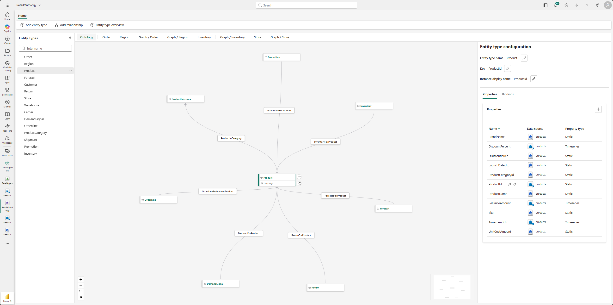
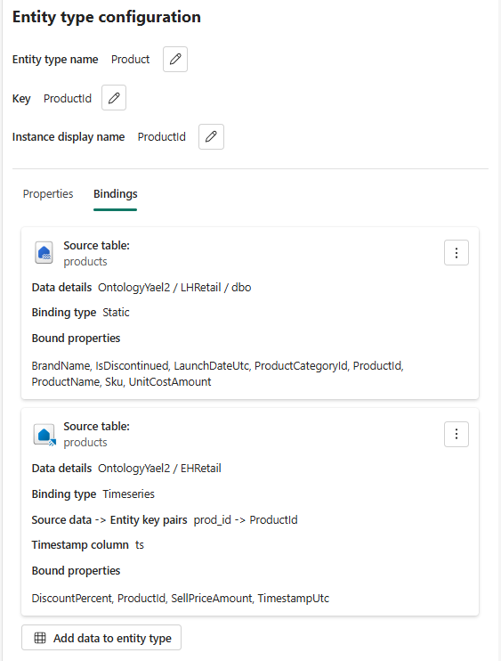

# Exercise 3: Explore deployed artifacts

While you wait for the graph to finish refreshing, explore the artifacts the setup notebook created.

## Inspect Eventhouse tables

1. In your Fabric workspace, select the **EHRetail** Eventhouse.
1. Open the database and review the following tables:

   | Table | Description |
   |---|---|
   | *carriers* | Rows with carrier IDs, service type codes, and coverage area identifiers |
   | *customers* | Rows with customer IDs, loyalty tier codes, lifetime value scores, and contact fields |
   | *demand_signals* | Rows with product and region ID pairs, signal strength values, and timestamps |
   | *forecasts* | Rows with product IDs, predicted demand quantities, and forecast period dates |
   | *inventories* | Rows with warehouse and product ID pairs, stock quantities, and reorder thresholds |
   | *products* | Rows with product IDs, discount percentages, and effective dates (fact/transactional data) |
   | *regions* | Rows with region codes, timezone offsets, and operational flags like cold-chain indicators |
   | *shipments* | Rows with shipment IDs, order/carrier/warehouse foreign keys, and status codes |
   | *stores* | Rows with store IDs, location coordinates, and operational attributes |

1. Select any table and review the raw data. Notice that this is "raw" operational data—column names might not be human-friendly, and values might include IDs rather than descriptive names. This is exactly what the ontology helps resolve by layering business meaning on top.

## Inspect the Lakehouse

1. Return to your workspace and open the **LHRetail** Lakehouse.
1. In the **Lakehouse explorer** pane, expand the **Tables** folder. You should see Delta tables that the setup notebook created from the generated retail data. These tables serve as additional data sources for the ontology.
1. Select a table (for example, *orders* or *returns*) to preview its contents. Compare the structure here with what you saw in the Eventhouse tables. Notice that:
   - The Lakehouse tables may contain different columns or additional data that complements the Eventhouse tables.
   - Some entity types in the ontology bind to Lakehouse tables rather than Eventhouse tables, demonstrating how ontology can unify data across multiple storage engines.

1. Compare the *products* data across both engines:
   - In the Lakehouse, the *products* table contains **dimensional data**—static attributes that describe each product, such as name, category, and pricing.
   - In the Eventhouse, the *products* table contains **fact data**—transactional records about discounts applied to different products over time.
   - These two tables represent different facets of the same business concept (*Product*). The ontology unifies both under a single *Product* entity type, so downstream consumers like Graph queries and Data Agent don't need to know which engine stores which aspect of the data.

1. Check the **Table details** to see the row count, schema, and column types. This helps you understand the scale of data the ontology operates over.

   > [!TIP]
   > The Lakehouse and Eventhouse serve different roles in this scenario. Eventhouse holds operational and streaming data optimized for real-time queries, while the Lakehouse stores batch and historical data. The ontology unifies both under a single set of business concepts.

## Explore ontology structure

1. Return to your workspace and open the **Ontology** item.
1. In the **Entity Types** pane, review the list of entity types. You should see all 15 entity types listed in the [Scenario overview](index.md#scenario-overview).
1. Start by selecting the **Product** entity type. In the previous step, you saw that product data lives in two places: the Lakehouse holds dimensional attributes (name, category, pricing) and the Eventhouse holds fact data (discount records). Now see how the ontology brings these together:

   

   1. Look on the righthand pane of **Entity type configuration** to view the properties and bindings. 
   1. Review the list of properties on the *Product* entity type. Notice that some properties are bound to columns in the Lakehouse *products* table (for example, product name, category, and unit cost) while other properties are bound to columns in the Eventhouse *products* table (for example, discount percent and date).
   1. Select the **Bindings** tab for *Product*. This tab shows cards for each source table that is bound to this entity.

   
    
    > [!NOTE]
    > This is the core value of an ontology: a single *Product* entity type presents a unified view of the concept, even though the underlying data comes from two different storage engines. Consumers of the ontology—Graph, GQL, and Data Agent—don't need to know where each property originates.

1. Now explore the relationships connected to *Product*. 
   - **ProductInCategory** - Links a *Product* to its *ProductCategory*, so you can answer questions like "Which products belong to the frozen goods category?"
   - **InventoryForProduct** - Links *Inventory* records to a *Product*, showing stock levels at each warehouse for that product.
   - **PromotionForProduct** - Links *Promotion* campaigns to the *Product* they target, connecting marketing activity to specific items.

   These relationships turn isolated tables into a connected graph. A single *Product* node can lead you to its category, its inventory across warehouses, and any active promotions—all without writing joins or knowing which tables live in which engine.

1. Review the remaining relationship types to see the broader graph structure:
   - *OrderPlacedByCustomer* (which customer placed the order)
   - *OrderFulfilledToRegion* (where the order was fulfilled)
   - *OrderHasLineItem* (what was ordered)
   - *ShipmentFulfillsOrder* (what shipment fulfilled the order)
   - *ShipmentDepartedFromWarehouse* (where inventory is stored)

1. Return to the **Data Bindings** view and explore bindings for a few more entity types. For example, the *Customer* entity type binds to the *customers* table in EHRetail and the *customers* table in the lakehouse. Look at the icon to understand which type of binding is used.

> [!TIP]
> Fabric IQ agents change their reasoning strategy based on the type of data binding. This distinction is important to understand before you reach the Data Agent step later in the lab.
>
> **Static bindings** point to dimensional or slowly changing data—attributes like customer name, product category, or region timezone. When an agent answers questions using static bindings, it:
>
> - Treats property values as current facts.
> - Doesn't perform temporal reasoning (it can't explain *when* or *why* something changed).
> - Returns answers like: *"The loyalty tier for Customer CUST000297 is Gold."*
>
> **Time-series bindings** point to data that changes over time—sensor readings, transaction logs, or demand signals with timestamps. When an agent answers questions using time-series bindings, it:
>
> - Can trace causality across time-ordered observations.
> - Can explain what led to a particular state or condition.
> - Can reason about exceptions, violations, and trends.
> - Returns answers like: *"Demand for product PROD00042 spiked at 14:30 due to three consecutive high-signal readings from the southwest region."*
>
> This difference matters because the same question can produce very different answers depending on the binding type. A static binding for a product's condition returns a flat fact (*"The product is in stock"*), while a time-series binding for inventory levels enables the agent to explain *why* stock dropped and *when* the change occurred.
>
> In this lab, most bindings are static (dimensional tables in the Lakehouse, fact snapshots in the Eventhouse). As you try the Data Agent in [Exercise 6](06-try-the-data-agent.md), keep this distinction in mind—the agent's responses reflect the binding types available in the ontology. Additionally, the current implementation of the Data Agent only uses NL->GQL.

---

**Next:** [Exercise 4: Explore the graph](04-explore-the-graph.md)
