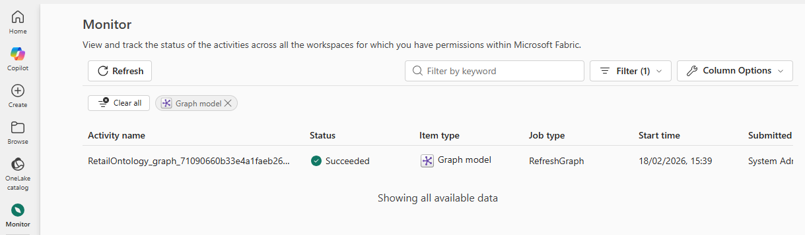
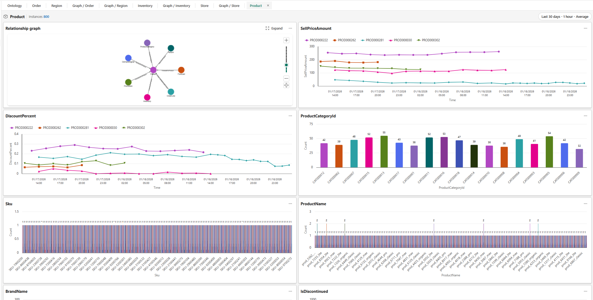
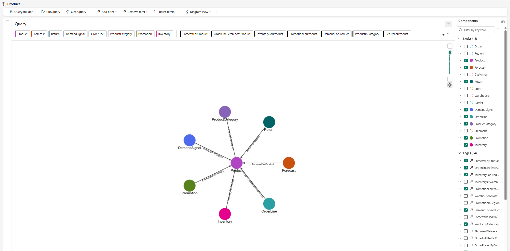
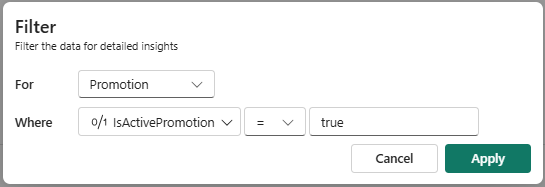
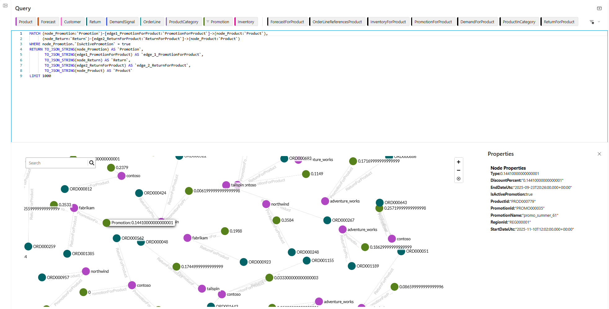

[← Previous: Explore deployed artifacts](03-explore-deployed-artifacts.md) | [Next: Run GQL queries →](05-run-gql-queries.md)

# Exercise 4: Explore the graph

Once the graph refresh completes, you can visually explore the connected data.

## Check graph refresh status

Before you proceed, confirm that the graph refresh triggered by the setup notebook has finished.

1. In the Fabric navigation bar on the left, select the **Monitor** icon.
1. In the monitoring view, look for the graph refresh activity associated with your ontology. 

   

1. If the refresh is still in progress, wait for it to complete before continuing. Graph refresh can take up to 15 minutes depending on the volume of data and current capacity utilization.
1. Once the status shows **Completed**, return to your ontology to begin exploring the graph.

## Navigate the graph view

1. From the **Product** entity, open the **Entity type overview**.

   

1. Take a look around the different preview aspects of the data associated with this entity.
1. In the top left card, select **Expand** on the **Relationship Graph**. This opens the graph view centered on *Product* nodes.

   

1. The graph view displays entity instances as nodes and relationships as edges. You can:
   - **Pan and zoom** to navigate through the graph.
   - **Select a node** to view its properties and connected entities.
   - **Follow edges** to traverse relationships. 

1. Try exploring how the **Product** node you have started exploring is connected to regions. A selection of tools appears fanning out from the node. Select the **+** sign to add a connected node. In this case, the only option is **Order**, so select that node. Repeat for the **Order** node, this time adding the connected **Region** node. Similarly, you can click on a node and then select **X** to remove it from the graph view. Notice that the corresponding edges are also added and removed as you add and remove nodes.

   > [!IMPORTANT]
   > Don't make any data or schema changes to the ontology during Graph exploration. Graph refresh is expensive and time-consuming, so changes would require another lengthy refresh cycle.

## Query the graph using the UI

Now use the visual query builder to run queries. We are going to find active promotions that had returns associated with them.

1. Select **Clear query** from the Product menu bar.
1. In the graph query UI, build a path by selecting the  **Return** &rarr; **Product** &rarr; **Promotion** nodes from the righthand pane.
1. Add their connecting edges *ReturnForProduct* and *PromotionForProduct* to the path. This tells the query engine to traverse from return records, through the associated product, to any promotions linked to that product.
1. Add a filter on the **Promotion** node: set **IsActivePromotion** equal to **true**. This narrows results to only promotions that are currently active.

   

1. Select **Apply** to confirm the query configuration.
1. Select **Run** to execute the query.
1. Review the results. You should see a list of active promotions where the promoted product also had returns. This type of insight—connecting returns back to marketing campaigns—is difficult to achieve with flat table queries but straightforward when the data is modeled as a graph.

   

1. Select **Query builder** &rarr; **Code editor** to view the GQL query that the visual builder generated. This shows the underlying GQL syntax that corresponds to the path and filter you configured. Take a moment to read through the query structure before moving on to writing GQL manually in the next step.

---

[← Previous: Explore deployed artifacts](03-explore-deployed-artifacts.md) | [Next: Run GQL queries →](05-run-gql-queries.md)
